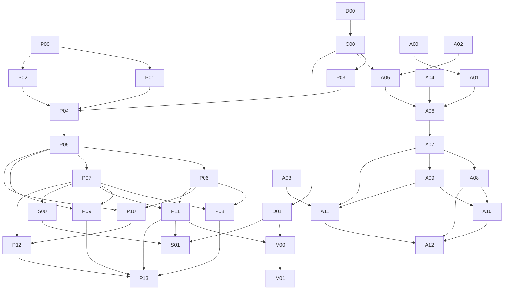

# Dependencies and parallel ownership

Machine DAG: artifacts/pr-dependency-graph.json. Logical IDs are not existing PR numbers. The JSON lists all direct prerequisites; this overview groups related stages.

Primary session owns contract synthesis, licensing interpretation, fixture publication and migration version allocation. Subagents may investigate/test independently but cannot choose incompatible schemas or models. Fresh-context review should come from the current execution harness and inspect exact diff/test evidence, not merely trust the implementer's report.

Initial independent lanes: Python bootstrap; Android strict restore; Android calibration correction; Android numerical-action honesty; Android emulator CI; owner rights/privacy-policy preparation. Restore/reconciliation share LedgerRepository and merge sequentially. P01/P02 share db_manager and need one integration owner. Use isolated worktrees; no shared writable checkout.

After C00, Python and Kotlin DTO/runner implementations can run in parallel against one approved manifest. Storage migrations are sequential inside each repo. Deterministic implementations can parallelize, then compare exact reports. Portability and manual simulation can proceed after stable DTO/reducer interfaces. Calibration and debt may have separate owners, both using the same identity/account contract.

Frontend workers can build synthetic accessible presentation from approved engine bundles; arbitrary personal inputs wait for service/privacy. No temporary TypeScript arithmetic. MCP descriptions/UI tests can prepare independently, but real-data deployment waits for authorization and D01.

Sequential operations: versioned schema/ID backfill, ambiguity repair, financial cutover, fixture release and retirement. Do not allocate duplicate migration numbers or remove historical readers because a new schema is current. A stage split must retain all parent dependencies and acceptance gates.

Deferred: persistent cloud ledger/sync, automatic bank connectivity/payment execution, FX, issuer-exact statements, generalized correlated Monte Carlo, Rust/KMP extraction and third financial implementation. They are not hidden prerequisites for shipping a useful local CLI and native app.
